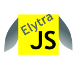

# elytra.js
An extremely lightweight JS toolkit for components and data watching. When minified, the source code is only 1.58 kilboytes or 1,619 bytes.

## Getting started
- Check out our [docs](http://jonahemorgan.github.io/elytra.js)
- Try out the code in ./examples
- Read what [ChatGPT thinks](http://github.com/JonahEMorgan/elytra.js/blob/master/chatgpt.md) of the source code 

## What is this for?
This library will make it easier to develop simple applications such as dashboards, surveys, or anything which relies on connecting data to HTML. It can be used for prototyping or small projects and is not intended to replace React in your enterprise application.

## Why is it so small?
I didn't spend much time adding extra features.

## Who are you?
I'm a member of Team 20, a high school robotics team.